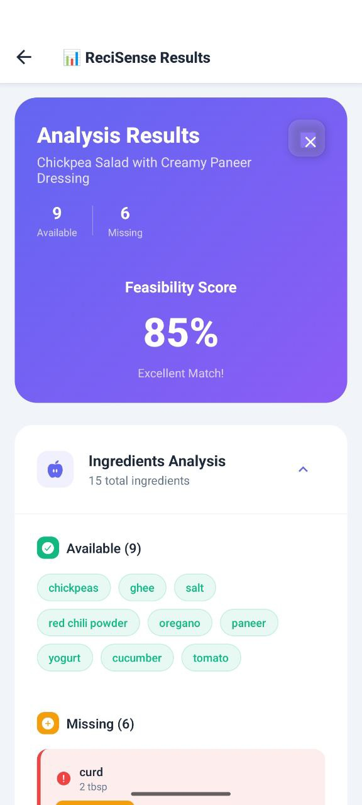
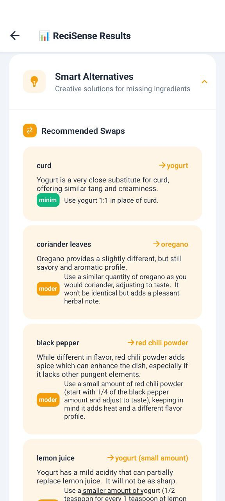

# AI Recipe App

A cross-platform mobile application built with React Native Expo and Node.js that analyzes recipe feasibility based on your pantry ingredients using AI and OCR technology.

## ✨ Features

### 🧺 Smart Pantry Management
- **Digital Pantry**: Store and manage your available ingredients
- **Category Organization**: Organize ingredients by type (dairy, meat, vegetables, etc.)
- **Expiry Tracking**: Monitor ingredient expiration dates
- **Bulk Adding**: Add multiple ingredients at once
- **Search & Filter**: Quickly find ingredients in your pantry

### 📸 Recipe Image Analysis
- **OCR Text Extraction**: Extract recipe text from images
- **Camera Integration**: Take photos or select from gallery
- **Image Preprocessing**: Automatic image enhancement for better OCR results
- **Multiple Formats**: Support for JPEG, jpg, GIF, and WebP images

### 🤖 AI-Powered Analysis
- **Gemini AI Integration**: Advanced recipe analysis using Google's Gemini Model
- **Feasibility Scoring**: 0-100% compatibility score with your pantry
- **Ingredient Matching**: Identify available vs. missing ingredients
- **Smart Substitutions**: AI-suggested ingredient alternatives
- **Cooking Tips**: Personalized recommendations and modifications

### 📊 Detailed Results
- **Visual Feasibility Score**: Color-coded progress indicators
- **Missing Ingredients List**: What you need to buy
- **Available Ingredients**: What you already have
- **Recipe Modifications**: Suggested changes for better feasibility
- **Nutritional Information**: Estimated calories, difficulty, and cooking time

## 📱 Screenshots

### Recipe Analysis & Results

*Advanced AI analysis showing feasibility scoring, ingredient matching, and intelligent substitution suggestions*

### Pantry Management

*Comprehensive pantry management with categorized ingredients and smart search functionality*

### Recipe Upload & Home

*Intuitive user interface with camera integration and recipe image processing capabilities*

## 🏗️ Architecture

### Frontend (React Native Expo)
- **Framework**: React Native with Expo
- **State Management**: Zustand
- **UI Components**: React Native Paper
- **Navigation**: React Navigation v6
- **Image Handling**: Expo Image Picker
- **Styling**: Custom theme system

### Backend (Node.js + Express)
- **Server**: Express.js with TypeScript support
- **Database**: MongoDB with Mongoose ODM
- **OCR**: Tesseract.js for text extraction
- **AI**: Google Gemini Pro API
- **File Handling**: Multer for temporary image uploads
- **Security**: Helmet, CORS, rate limiting

### AI & Processing
- **OCR Engine**: Tesseract.js with custom preprocessing
- **AI Model**: Google Gemini Pro for recipe analysis
- **Image Processing**: Sharp for image optimization
- **Text Analysis**: Custom recipe parsing algorithms

## 📱 Usage Guide

### 1. Setting Up Your Pantry
1. Open the app and navigate to the "Pantry" tab
2. Tap the "+" button to add ingredients
3. Fill in ingredient details:
   - Name (required)
   - Category (dairy, meat, vegetable, etc.)
   - Quantity and unit
   - Expiry date (optional)
4. Save the ingredient

### 2. Analyzing a Recipe
1. Navigate to the "Upload Recipe" tab
2. Choose "Take Photo" or "Choose Photo"
3. Select/capture an image of the recipe
4. Tap "Analyze Recipe"
5. Wait for AI processing (usually 10-30 seconds)
6. View detailed results

### 3. Understanding Results
- **Feasibility Score**: 
  - 80-100%: Excellent (all/most ingredients available)
  - 60-79%: Good (some substitutions needed)
  - 40-59%: Fair (several missing ingredients)
  - 20-39%: Poor (major modifications required)
  - 0-19%: Very Poor (not feasible)

### Performance Tips
- Keep image sizes reasonable (< 5MB)
- Add ingredients before analyzing recipes
- Use clear, well-lit photos
- Ensure recipe text is visible and readable

